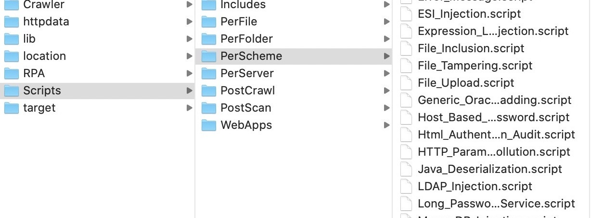

# awvs-decode
awvs script decode

最新解码方法，除python外无须安装任何依赖，支持11.x,12.x,13.x，以及后续版本

15行code解码 awvs “wvsc_blob.bin”文件扫描脚本



## 使用方法
将wvsc_blob.bin文件放到和脚本同一目录，执行脚本即可
```bash
$ python3 awvs_decode.py
```

## 免责声明
该脚本仅用于个人私下研究技术用，一切后果就使用者承担
